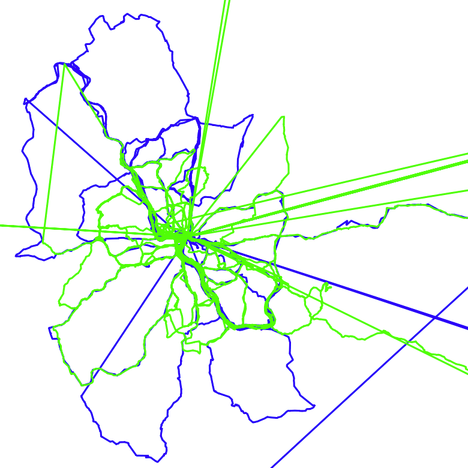

# GPSplit

> No more messy GPX files!

GPSplit is a GPX toolkit that is built on top of the
[GPXGO](https://github.com/tkrajina/gpxgo) library by
[@tkrajina](https://github.com/tkrajina).

GPSplit was motivated by a personal GPX file that spans
multiple years of bike tours within a single GPX segment. This GPX file
demanded a fast way of automatically splitting segments, e.g., if there is no
relevant movement over longer time, if single segments are too short, if the
start and end of a segment has no significant movement, or if there is a huge
time / distance jump between two points.

* GPSplit provides functionality for splitting, filtering, and analyzing GPX
  files, tracks, and segments.
* The GPSplit command line interface allows combining multiple split / filter
  rules through UNIX pipes.
* GPSplit makes it easy to define custom split / filter rules.
* GPSplit can be used as a library in combination with
  [GPXGO](https://github.com/tkrajina/gpxgo).

## Installation
Install Go 1.22 and run
```bash
go install github.com/abzicht/gpsplit
```

## Examples

This command splits a GPX file into multiple files. Splitting is performed, if
a GPX segment has a time jump of over 8 hours between two points.

```bash
cat ./my-recording.gpx | gpsplit --out ./ split --time 8h
```

The gif below shows the before (two GPX segments, spanning multiple years) and
after (over 100 individual tracks) of using `gpsplit`.



The following command was used to obtain this result:

```bash
gpsplit -i ./my-recording.gpx split -d 5000 -t 8h --pause-split 200,1h | gpsplit filter --trim 50 | gpsplit -o ./gpx direct --simplify 40 --min-radius 1000 --min-points 80
```

In short, this command splits a large GPX file into multiple files whenever it
detects pauses and interrupts within recorded GPX segments. Furthermore, it
cleans those segments up and simplifies their tracks. Finally, it removes
segments that are too short.

The whole command can be broken down as follows:

* `gpsplit -i ./my-recording.gpx` instructs `gpsplit` to read from
  `./my-recording.gpx`
* `split -d 5000 -t 8h --pause-split 200,1h` splits all segments that have
  certain jumps between consecutive points.
  + `-t 8h` splits, if the duration between two consecutive points is over 8
    hours.
  + `-d 5000` splits, if the distance between two consecutive points is over
    5000 meters.
  + `--pause-split 200,1h` splits, if we remained within a 200 meter radius for
    at least 1 hour. The split is performed as soon as we leave the 200 meter
    radius. I.e., the detected _pause_ remains in the first sub-segment.
* `| gpsplit ...`: we do not specify an input file, so we read the
  GPX data returned by the previous command.
* `filter --trim 50` removes all points at the start and end of a segment that
  lie within a 50 meter radius to the starting / ending point. The first point and
  the last point are not removed.
* `| gpsplit -o ./gpx` reads from the previous command and stores all GPX files
  within the provided folder `./gpx`.
* `direct --simplify 40 --min-radius 1000 --min-points 80` applies misc. functions
that are applied directly on GPX segments.
  + `--simplify 40` applies the Ramer-Douglas-Peucker algorithm for removing
    unnecessary GPX points if they lie outside a 40 meter range with respect to
    their neighboring points.
  + `--min-radius 1000` removes segments completely, if their points lie within
    a 1000 meter radius to the starting point.
  + `--min-points 80` removes segments completely, if they have less than 80
    GPX points.

## Library

The `gpxtransform` package provides functions for transforming GPX segments,
tracks, and whole files. Transformations are performed based on a
`config.TransformConfig` object that holds corresponding transformation
functions. The following prepares a corresponding object with a segment
transformer that splits tracks with multiple segments into multiple tracks with one
segment each:

```go
tc := config.NewTransformConfig(config.WithTrackTransform(gpxtransform.SplitTrackBySegment()))
// corresponding functions also exist for splitting files
// based on tracks (cf. gpxtransform.SplitFileByTrack)
```

We can also choose to subsequently extend the `tc` object with segment
splitting functionality:

```go
duration := 8 * time.Hour
distance := 5000 * unit.Metre
tc = config.WithSegmentTransform(
        gpxtransform.Split(
            options.TimeSplit(duration),
            options.DistanceSplit(distance),
            ),
        )(tc)
// tc now splits segments into multiple segments, if there are too large time /
// distance jumps between two consecutive points
```

Finally, we can apply the transformation on a GPX file/track/segment:

```go
reader, err := os.Open("./my-recording.gpx")
if err != nil {panic(err)}
gpxFile, err := gpx.Parse(reader)
if err != nil {panic(err)}

processedFiles, err := gpxtransform.TransformFile(*gpxFile, tc)
if err != nil {panic(err)}
// processedFiles now holds the (potentially multiple) files that we obtained
// from the transformation.
```

Besides `Split`, `gpxtransform` holds further transformation types, including
`Filter`, `AnalyzeFile`, and `Direct`. The last one, `Direct`, provides greatest
flexibility in regard to direct modification of GPX segments.

Most transformation types expect the specification of desired options (cf.
`gpxtransform.Split(options.TimeSplit(duration))`). The
[gpxtransform.options](gpxtransform/options) package provides corresponding
options that are also found in the command line interface.

It is straightforward to implement custom transformation options. E.g., the
option to split at large time jumps is defined as follows:

```go
func TimeSplit(maxStep time.Duration) SplitOptions {
    return SplitOptions{
        func(segment gpx.GPXTrackSegment, index int) (bool, error) {
            duration := segment.Points[index+1].Timestamp.Sub(segment.Points[index].Timestamp)
            // return true, iff we want to split:
            return maxStep <= duration, nil
        },
    }
}
```

So feel free to add your own options!
